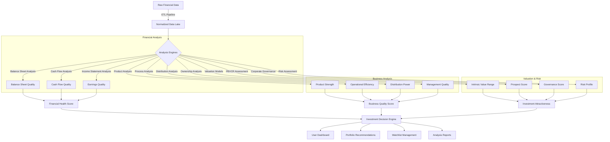
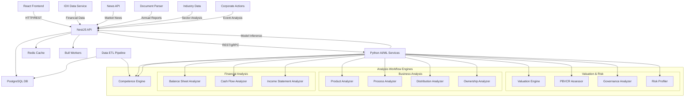
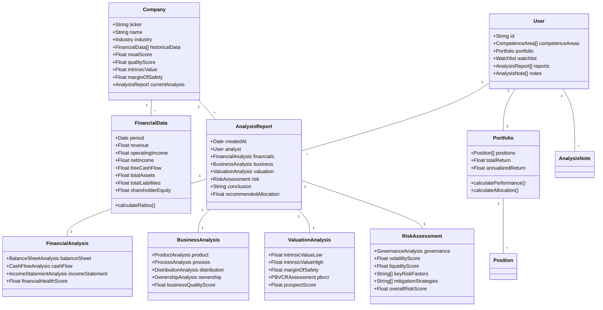

# ValinAI: AI-Driven Value Investing Platform

[](https://github.com/your-repo/value-investing-platform)
[](LICENSE)
[](https://github.com/your-repo/value-investing-platform/releases)
[](#api-documentation)

- **What**: A platform that applies Warren Buffett's value investing principles to the Indonesian stock market
- **For Who**: Busy professionals seeking long-term wealth building through quality investments
- **Key Features**: AI-powered business analysis, intrinsic value calculation, and personalized recommendations
- **Philosophy**: Buy wonderful businesses at fair prices, not fair businesses at wonderful prices

## Introduction

_"Price is what you pay; value is what you get."_ — Warren Buffett

Welcome to the ValinAI: AI-Driven Value Investing Platform, designed to embody Warren Buffett's time-tested investment philosophy. This platform helps busy professionals apply authentic value investing principles to the Indonesian stock market, with the flexibility to expand globally.

Our mission is simple: help you buy wonderful businesses at fair prices, not fair businesses at wonderful prices. Through intelligent automation and AI-powered analysis, we make Buffett's disciplined approach accessible to modern investors who understand that wealth-building is a marathon, not a sprint.

## Table of Contents

- [Features & Philosophy](#features)
- [Warren Buffett's Value Investing Principles](#warren-buffetts-value-investing-principles)
- [Indonesian Market Specialization](#indonesian-market-specialization)
- [From Philosophy to Implementation](#from-philosophy-to-implementation)
- [Technology Stack](#technology-stack)
- [System Architecture](#system-architecture)
- [Getting Started](#getting-started)
- [API Reference](#api-reference)
- [Development Environment](#development-environment)
- [Analysis Workflow](#analysis-workflow)
- [Educational Resources](#educational-resources)
- [Contributing & Code Quality](#contributing)
- [Risk Disclaimers & Privacy](#risk-disclaimers)
- [License](#license)
- [Future Roadmap](#future-roadmap)

## Features & Philosophy

### The Buffett Way: Business Ownership, Not Stock Trading

This platform treats every stock as what it truly is: **a piece of a business**. We don't predict stock prices; we analyze business fundamentals to determine what companies are worth owning for the long term.

### Custom Dashboard

The dashboard is simple, intuitive, and designed for quick insights:

- **Portfolio Overview**: Displays current holdings, performance metrics (e.g., unrealized gains/losses), and historical trends with clear visuals.
- **Stock Recommendations**: Highlights undervalued stocks based on Buffett's criteria, with a "Value Score" for quick assessment.
- **Market News**: Curated updates relevant to your portfolio, keeping you informed without overwhelm.
- **Learning Hub**: Bite-sized lessons and videos on value investing, tailored for busy schedules.

### AI-Powered Backend

The backend replicates Buffett's analytical rigor using cutting-edge AI:

- **Data Collection and Analysis**: Gathers and standardizes financial data from the Indonesia Stock Exchange (IDX) and global sources.
- **AI-Driven Screening**: Uses machine learning to identify undervalued stocks matching Buffett's criteria (e.g., consistent earnings, low debt, strong moats).
- **Intrinsic Value Calculation**: Estimates stock values using Discounted Cash Flow (DCF) and other methods to ensure a margin of safety.
- **Portfolio Management**: Manages your portfolio with real-time alerts and dashboards tailored to Indonesian market conditions.

### AI-Chat Feature

An interactive assistant for natural engagement:

- **Conversational Analysis**: Ask questions like, "Why is this stock undervalued?" or "Explain this company's moat."
- **Portfolio Tips**: Offers advice like, "Consider diversifying—60% of your portfolio is in one sector."

## Warren Buffett's Value Investing Principles

The platform embodies Buffett's philosophy through AI and user-facing features:

### 1. Circle of Competence

_"Risk comes from not knowing what you're doing."_

**Buffett's Approach:** Only invest in businesses you thoroughly understand.

**Platform Implementation:**

- **Business Model Analyzer**: AI breaks down complex business models into simple, understandable terms
- **Industry Deep Dives**: Curated educational content for each sector before recommending stocks
- **Competence Tracker**: Users define their areas of expertise; recommendations focus on these sectors first
- **"Can You Explain It?" Test**: Every recommendation includes a simple business model explanation

### 2. Wonderful Businesses at Fair Prices

_"It's far better to buy a wonderful company at a fair price than a fair company at a wonderful price."_

**Buffett's Approach:** Prioritize business quality over cheap prices.

**Platform Implementation:**

- **Economic Moat Analysis**: AI identifies competitive advantages (cost leadership, network effects, switching costs, intangible assets)
- **Predictability Score**: Evaluates earnings consistency and business model stability
- **Pricing Power Assessment**: Analyzes a company's ability to raise prices without losing customers
- **Management Quality Metrics**: Tracks capital allocation decisions and shareholder-friendly policies

### 3. Intrinsic Value Calculation

_"Intrinsic value can be defined simply: It is the discounted value of the cash that can be taken out of a business during its remaining life."_

**Buffett's Approach:** Conservative DCF analysis focused on owner earnings, not reported earnings.

**Platform Implementation:**

- **Owner Earnings Calculator**: Net income + depreciation - maintenance capex requirements
- **Conservative Growth Assumptions**: Uses historical averages and pessimistic scenarios
- **Multiple Valuation Methods**: DCF, P/E to growth, book value analysis, and asset-based approaches
- **Sensitivity Analysis**: Shows how intrinsic value changes with different assumptions

### 4. Significant Margin of Safety

_"The three most important words in investing are margin of safety."_

**Buffett's Approach:** Buy at substantial discounts to intrinsic value to protect against errors in judgment.

**Platform Implementation:**

- **Dynamic Safety Margins**: Requires larger margins for cyclical businesses (40-50%) vs. stable businesses (20-30%)
- **Business Quality Adjustment**: Higher quality businesses may warrant smaller margins of safety
- **Risk-Adjusted Pricing**: Adjusts required margins based on business predictability and competitive position

### 5. Long-Term Business Ownership

_"Our favorite holding period is forever."_

**Buffett's Approach:** Buy great businesses and hold them as long as they remain great.

**Platform Implementation:**

- **Forever Portfolio Builder**: Identifies businesses suitable for decade+ holding periods
- **Quality Deterioration Alerts**: Monitors key metrics that might signal declining business quality
- **Reinvestment Opportunities**: Tracks companies that consistently reinvest earnings at high returns
- **Compounding Calculators**: Shows the power of long-term holding with historical examples

### 6. Management Excellence

_"In looking for people to hire, you look for three qualities: integrity, intelligence, and energy. And if you don't have the first, the other two will kill you."_

**Buffett's Approach:** Focuses on honest, shareholder-friendly management teams with strong capital allocation skills.

**Platform Implementation:**

- **Management Integrity Score**: Analyzes executive communications, insider transactions, and accounting quality
- **Capital Allocation Tracker**: Evaluates management's history of reinvestment, acquisitions, and shareholder returns
- **Shareholder Communication Analysis**: Reviews annual reports and investor calls for candor and transparency
- **Incentive Structure Review**: Examines how management compensation aligns with shareholder interests

### 7. Economic Moats

_"The key to investing is determining the competitive advantage of any given company and, above all, the durability of that advantage."_

**Buffett's Approach:** Seeks businesses with sustainable competitive advantages that protect profits.

**Platform Implementation:**

- **Moat Identification System**: Categorizes competitive advantages by type and strength
- **Moat Durability Score**: Estimates how long a competitive advantage might persist
- **Industry Disruption Risk**: Assesses potential threats to established business models
- **Competitive Position Tracker**: Visual representation of moat strength over time

### 8. Consistent, Predictable Earnings

_"Volatility is not risk. Risk is the possibility of loss or inadequate returns."_

**Buffett's Approach:** Focus on businesses with predictable, growing earning power.

**Platform Implementation:**

- **Earnings Consistency Score**: Analyzes 10+ years of earnings patterns and volatility
- **Cyclical Business Detector**: Identifies and adjusts analysis for cyclical industries
- **Free Cash Flow Stability**: Measures consistency of cash generation over time
- **Earnings Quality Assessment**: Flags aggressive accounting practices that may distort true earnings

## Indonesian Market Specialization

The platform is specifically tailored for the Indonesian stock market:

### Local Market Expertise

- **IDX Data Integration**: Direct access to Indonesia Stock Exchange data
- **Bahasa Indonesia Support**: Full platform localization and language support
- **Local Regulatory Compliance**: Adherence to OJK (Financial Services Authority) regulations
- **Indonesia-Specific Metrics**: Adjusted valuation models for Indonesian market conditions

### Cultural Context

- **Local Business Understanding**: Analysis of family-owned businesses common in Indonesia
- **Political Risk Assessment**: Evaluation of regulatory and political factors specific to Indonesia
- **Currency Considerations**: Rupiah volatility and inflation impact on valuations
- **Sector Weighting**: Focus on Indonesia's economic strengths (resources, consumer, finance)

### Growth Opportunities

- **Emerging Market Potential**: Identifies companies positioned to benefit from Indonesia's growing middle class
- **Infrastructure Development**: Tracks businesses aligned with national infrastructure initiatives
- **Digital Transformation**: Highlights traditional businesses successfully adopting technology
- **Export Potential**: Evaluates companies with growing international market access

## From Philosophy to Implementation

### Translating Buffett's Principles to Technical Systems

This section outlines how we translate Warren Buffett's investment philosophy into concrete technical implementations:

| Investment Principle      | Technical Analysis Approach                         | Software Implementation                                                               |
| ------------------------- | --------------------------------------------------- | ------------------------------------------------------------------------------------- |
| **Circle of Competence**  | Domain expertise scoring algorithm                  | `competence_analyzer.py` with user knowledge graph and industry classification system |
| **Wonderful Businesses**  | Multi-factor quality scoring                        | `business_quality_engine.py` with 15+ quality metrics and time-series analysis        |
| **Intrinsic Value**       | DCF, Owner Earnings, and Multiple-based models      | `valuation_engine.py` with Monte Carlo simulations for range estimates                |
| **Margin of Safety**      | Dynamic safety threshold calculation                | `margin_calculator.py` with business quality correlation                              |
| **Long-Term Ownership**   | Compounding simulation and quality persistence      | `compounding_simulator.py` with 10-year forward projections                           |
| **Management Excellence** | NLP sentiment analysis on management communications | `management_analyzer.py` with executive integrity scoring                             |
| **Economic Moats**        | Competitive advantage classification                | `moat_detector.py` with industry-specific moat identification                         |
| **Consistent Earnings**   | Time-series analysis of earnings stability          | `earnings_consistency.py` with volatility and growth pattern recognition              |

### Data Flow Architecture



## Technology Stack

This repository is a Lovable template-based frontend built with Vite + React + TypeScript. The current stack (based on code in `package.json`, `vite.config.ts`, and `src/`) is:

- **Build Tooling**: Vite 5 with `@vitejs/plugin-react-swc` (dev server on port 8080 per `vite.config.ts`)
- **Framework**: React 18 + TypeScript
- **Styling/UI**: Tailwind CSS, shadcn/ui (Radix primitives), Tailwind Typography, Lucide Icons
- **Routing**: React Router v6
- **Data/State**: TanStack Query, React Hook Form, Zod
- **Charts**: Recharts
- **Utilities**: clsx, class-variance-authority, tailwind-merge, date-fns
- **Backend-as-a-Service**: Supabase (`@supabase/supabase-js`)
- **Linting/Quality**: ESLint, TypeScript

Project scripts (`package.json`):

```text
dev         Start Vite dev server (http://localhost:8080)
build       Build production assets
build:dev   Build in development mode
preview     Preview the production build
lint        Run ESLint
```

## System Architecture

### Core Components



### Domain Model



### Folder Structure

```bash
value-investing-platform/
├── backend/
│   ├── src/
│   │   ├── main.ts
│   │   ├── app.module.ts
│   │   ├── config/
│   │   │   └── configuration.ts
│   │   ├── entities/
│   │   │   ├── user.entity.ts
│   │   │   ├── company.entity.ts
│   │   │   └── portfolio.entity.ts
│   │   ├── modules/
│   │   │   ├── auth/
│   │   │   │   ├── auth.controller.ts
│   │   │   │   ├── auth.service.ts
│   │   │   │   └── auth.module.ts
│   │   │   └── portfolio/
│   │   │       ├── portfolio.controller.ts
│   │   │       ├── portfolio.service.ts
│   │   │       └── portfolio.module.ts
│   │   ├── services/
│   │   │   ├── valuation.service.ts
│   │   │   └── data-import.service.ts
│   │   └── shared/
│   │       └── utils.ts
├── frontend/
│   ├── public/
│   ├── src/
│   │   ├── components/
│   │   │   ├── Dashboard/
│   │   │   ├── Analysis/
│   │   │   ├── Portfolio/
│   │   │   └── Learning/
│   │   ├── pages/
│   │   ├── hooks/
│   │   └── utils/
├── ml/
│   ├── training/
│   ├── evaluation/
│   └── data/
├── docker-compose.yml
├── .env.example
├── README.md
└── docs/
    ├── ARCHITECTURE.md
    ├── API.md
    ├── MODELS.md
    └── PHILOSOPHY.md
```

## API Reference

> Full documentation in [`docs/API.md`](docs/API.md)

| Method | Endpoint             | Description                        |
| ------ | -------------------- | ---------------------------------- |
| GET    | `/api/stocks`        | List supported stocks              |
| GET    | `/api/stock/:ticker` | Fetch fundamentals & valuation     |
| POST   | `/api/analyze`       | Perform full Buffett analysis      |
| POST   | `/api/competence`    | Update user's circle of competence |
| GET    | `/api/moat/:ticker`  | Get company moat strength          |

- All endpoints return JSON.
- Authentication: JWT Bearer tokens via Auth0. Send `Authorization: Bearer <token>`. See `docs/AUTHENTICATION_SETUP.md`.

## Contributing & Code Quality

We welcome contributions that align with authentic value investing principles. Please review our [Contributing Guidelines](CONTRIBUTING.md) and ensure all additions maintain focus on long-term business analysis rather than short-term trading strategies.

### Pull Request Process

1. Fork the repository
2. Create a feature branch
3. Add tests for your changes
4. Ensure all tests pass
5. Submit a pull request with clear descriptions

### Testing Framework

```bash
python -m pytest
```

We use pytest for unit and integration tests. All tests are in the `/tests` directory.

### Code Quality

```bash
flake8 backend
black backend
```

We enforce PEP8 standards with flake8 and black for Python and ESLint/Prettier for JavaScript.

## Investment Criteria & Analysis Workflow

### Business Quality Checklist

- [ ] Simple, understandable business model
- [ ] Consistent earning power over 10+ years
- [ ] Strong return on equity (15%+)
- [ ] Low debt-to-equity ratio
- [ ] Management with integrity and ability
- [ ] Predictable, growing free cash flows

### Valuation Standards

- **Conservative Growth Assumptions**: Use historical averages or lower
- **Multiple Scenario Analysis**: Best case, worst case, and most likely outcomes
- **Quality Adjustment**: Higher multiples acceptable for exceptional businesses
- **Margin of Safety**: Minimum 20% for excellent businesses, 40%+ for average businesses

### Analysis Workflow

The platform implements a structured financial and business analysis workflow based on Warren Buffett's principles, adapted specifically for the Indonesian market. This comprehensive checklist ensures thorough evaluation of potential investments.

### Financial Statement Analysis

> **Understanding Financial Statements**: The platform provides guidance on accounting terminology and definitions for each account in the notes section of financial statements. No prior accounting knowledge required.

#### Balance Sheet Analysis (10-Year History)

**Data Sources:**

- IDX website (3 years of data)
- Company investor relations websites (10+ years)
- TICMI database (premium subscription)
- Platform's proprietary data lake

**Analysis Approach:**

1. Is the composition of fixed assets, working capital, and other assets reasonable?
   - _Compare with industry peers both in Indonesia and globally_
   - _Platform provides automated peer comparison visualizations_

2. What is the debt value, debt-to-equity ratio (DER), and annual interest expense percentage?
   - _Analyze trend over time and against industry benchmarks_
   - _Platform calculates debt service coverage and interest burden metrics_

3. Are there any accounts showing significant and material spikes?
   - _Automated anomaly detection highlights unusual changes_
   - _Cross-reference with corporate actions and news events_

4. Is the turnover of inventory, accounts receivable, and total assets reasonable?
   - _Compare with historical performance and industry standards_
   - _Platform provides efficiency ratio benchmarks by industry_

5. For capital-intensive fixed assets, are depreciation rates and asset lifespans reasonable?
   - _Compare with industry standards and technological obsolescence rates_
   - _Platform estimates realistic asset replacement cycles_

6. What are the provisions for bad debts and obsolete inventory, and are they reasonable?
   - _Compare with actual write-offs and industry practices_
   - _Platform flags aggressive or conservative accounting practices_

> **Insight Generation**: The platform automatically generates observations about balance sheet quality and flags potential concerns.

#### Cash Flow Analysis

**Data Sources:**

- Quarterly and annual cash flow statements
- Management discussion and analysis sections
- Capital expenditure announcements
- Dividend history

**Analysis Approach:**

1. Does cash received from customers align with revenue in the income statement?
   - _Platform calculates cash conversion ratios and flags discrepancies_
   - _Trend analysis of cash vs. accrual performance_

2. Are debt payments and dividend distributions reasonable?
   - _Compare with stated policies and historical patterns_
   - _Platform provides sustainable dividend and debt service models_

3. Is capital expenditure in line with planned investments?
   - _Cross-reference with company announcements, news articles, and public exposures_
   - _Platform tracks capex efficiency and return on invested capital_

4. Are cash outflows for salaries, interest, and taxes consistent with the income statement?
   - _Platform identifies discrepancies and potential accounting issues_
   - _Trend analysis of key expense categories_

> **Insight Generation**: The platform calculates free cash flow metrics and owner earnings adjustments following Buffett's methodology.

#### Income Statement Analysis

**Data Sources:**

- Segment reporting in annual reports
- Quarterly financial statements
- Industry production cost benchmarks
- Company presentations and public exposures

**Analysis Approach:**

1. Is the cost structure and gross profit per segment reasonable?
   - _Divide total COGS by sales volume to derive unit economics_
   - _Compare with industry benchmarks and production processes_
   - _Platform provides visualization of cost structure evolution_

2. Are cost of goods sold and operational expenses per segment reasonable?
   - _Analyze based on understanding of business processes and raw material inputs_
   - _Platform provides component-level cost analysis (e.g., tobacco, paper, and filter costs in cigarette production)_

3. Does quarterly income statement analysis align with sales volume, average selling price (ASP), and cost changes?
   - _Platform automatically calculates quarter-on-quarter changes_
   - _Correlation analysis with known market events and price changes_

> **Insight Generation**: The platform identifies margin trends, cost pressures, and pricing power indicators.

### Business Analysis

#### Product Analysis

**Data Sources:**

- Annual reports and presentations
- Public exposures and investor materials
- Company websites and product catalogs
- Industry reports and market research

**Analysis Approach:**

1. Are the main products, volumes, and average selling prices (ASP) clearly identified?
   - _Platform extracts and structures this information from company disclosures_
   - _Visualization of product mix evolution and contribution margins_

2. Are the factors affecting volume and recent ASP changes well understood?
   - _Platform aggregates news, industry trends, and company-specific factors_
   - _Correlation analysis with macroeconomic and industry-specific variables_

3. What is the global and Indonesian supply and demand condition for the product?
   - _Platform integrates data from industry associations (GAIKINDO, GAPKI, etc.)_
   - _Specialized data sources like InfoSawit.com, IEA reports, and sector analyses_

4. What factors influence product supply and demand?
   - _Platform provides multi-factor analysis of demand drivers_
   - _Scenario modeling for different market conditions_

#### Process Analysis

**Data Sources:**

- Annual reports and sustainability reports
- Industry benchmarks for production efficiency
- Commodity price databases
- Labor market statistics

**Analysis Approach:**

1. Have the main raw materials, electricity, water, and production support been analyzed?
   - _Platform provides component-level breakdown of production inputs_
   - _Visualization of resource efficiency compared to industry standards_

2. What are the costs of raw materials, employees, and other supporting expenses?
   - _Platform tracks input cost trends and correlates with market prices_
   - _Sensitivity analysis for key input cost changes_

3. What percentage does each account represent in the cost of goods sold?
   - _Platform generates cost structure visualizations and identifies key cost drivers_
   - _Comparison with industry benchmarks and historical trends_

4. What is the value of interest expense?
   - _Platform calculates effective interest rates and debt service coverage_
   - _Trend analysis of financing costs relative to market rates_

> **Insight Generation**: The platform identifies cost advantages, operational efficiency, and vulnerability to input price changes.

#### Distribution Analysis

**Data Sources:**

- Company logistics disclosures
- Industry distribution benchmarks
- Marketing expense breakdowns
- Channel partner information

**Analysis Approach:**

1. Has the product distribution channel to end users been analyzed?
   - _Platform maps distribution networks and channel efficiency_
   - _Visualization of market coverage and distribution density_

2. What are the distribution and marketing costs?
   - _Platform calculates customer acquisition costs and lifetime value_
   - _Trend analysis of marketing efficiency and distribution costs_

> **Insight Generation**: The platform evaluates distribution advantages, market reach, and customer acquisition efficiency.

#### Ownership Analysis

**Data Sources:**

- Annual reports and financial statements
- Corporate governance reports
- Regulatory filings and disclosures
- Media archives and news databases

**Analysis Approach:**

1. What are the salaries/remuneration of employees and directors?
   - _Platform compares executive compensation with industry benchmarks_
   - _Analysis of alignment between compensation and shareholder returns_

2. Are related party transactions affecting expenses, assets, and materials reasonable?
   - _Platform flags unusual related party transactions and analyzes pricing fairness_
   - _Comparison with arm's length transaction benchmarks_

3. Are there important corporate actions (rights issues, profit distributions)?
   - _Platform provides historical analysis of capital allocation decisions_
   - _Assessment of shareholder-friendly versus management-friendly actions_

4. What is the track record and character of the owners as portrayed in media?
   - _Platform performs sentiment analysis on media coverage of key shareholders_
   - _Background checks and reputation assessment of major owners_

> **Insight Generation**: The platform evaluates owner integrity, capital allocation skill, and alignment with minority shareholders.

### Valuation Analysis

**Data Sources:**

- Historical financial statements
- Industry growth projections
- Market pricing data
- Company guidance and forecasts

**Analysis Approach:**

1. What is the true earning based on realistic volume × ASP?
   - _Platform calculates normalized earnings based on sustainable volumes and prices_
   - _Adjustments for cyclical and non-recurring items_

2. What is the growth projection based on supply & demand and company size?
   - _Platform generates growth models based on industry capacity and market share_
   - _Size-adjusted growth expectations following Buffett's principle that size limits growth_

3. What is the company's P/E ratio?
   - _Platform calculates multiple valuation metrics (trailing, forward, normalized)_
   - _Comparison with historical averages, industry peers, and quality-adjusted benchmarks_

> **Insight Generation**: The platform provides intrinsic value ranges with probability distributions rather than single-point estimates.

### PBVCR Assessment

#### Prospect Analysis

**Data Sources:**

- Historical financial performance
- Industry growth forecasts
- Competitive landscape analysis
- Economic moat assessment

**Analysis Approach:**

1. Is earnings and revenue growth sustainable?
   - _Platform performs time-series analysis and growth sustainability scoring_
   - _Identification of growth drivers and their persistence_

2. Is profitability (ROE, NPM, ROIC, IRR) satisfactory?
   - _Platform compares profitability metrics against cost of capital_
   - _Trend analysis and comparison with industry benchmarks_

3. How is the quality of asset management (Total Asset Turnover, Fixed Asset Turnover)?
   - _Platform evaluates capital efficiency and asset utilization trends_
   - _Comparison with industry best practices_

4. What is the competitive advantage (economic moat)?
   - _Platform categorizes moat types (cost advantage, switching costs, network effects, etc.)_
   - _Quantitative assessment of moat strength and durability_

> **Insight Generation**: The platform provides a Prospect Score that combines growth sustainability and competitive advantage.

#### Balance Sheet Quality Analysis

**Data Sources:**

- Balance sheet history and trends
- Industry solvency benchmarks
- Cash flow quality metrics
- Working capital efficiency data

**Analysis Approach:**

1. What is the company's main debt-to-equity ratio (DER)?
   - _Platform calculates multiple leverage ratios including adjusted metrics_
   - _Stress testing of debt service capability under adverse scenarios_

2. How is liquidity (current ratio)?
   - _Platform evaluates short-term solvency with multiple liquidity ratios_
   - _Cash conversion cycle and working capital efficiency analysis_

3. What is the equity composition (common stock vs. retained earnings)?
   - _Platform analyzes organic growth versus external capital dependence_
   - _Assessment of capital allocation and reinvestment efficiency_

4. What is the revenue composition (cash vs. receivables)?
   - _Platform evaluates revenue quality and earnings reliability_
   - _Trend analysis of cash conversion and collection efficiency_

> **Insight Generation**: The platform provides a Balance Sheet Quality Score that assesses financial strength and resilience.

#### Valuation Metrics Analysis

**Data Sources:**

- Current market pricing
- Historical valuation ranges
- Industry valuation benchmarks
- Asset-based valuation inputs

**Analysis Approach:**

1. What are the P/E ratio and P/B ratio (main metrics)?
   - _Platform calculates current, historical, and normalized valuation multiples_
   - _Quality-adjusted valuation comparisons with peers_

2. Have calculations for NAV, NCAV, NNWC, FCFF, and DDM been performed?
   - _Platform provides multiple valuation methodologies with sensitivity analysis_
   - _Visualization of valuation ranges and probability distributions_

> **Insight Generation**: The platform provides a Valuation Score that assesses relative attractiveness compared to intrinsic value.

#### Corporate Governance Analysis

**Data Sources:**

- Corporate governance reports
- Board composition and history
- Dividend payment records
- Related party transaction disclosures
- Management communications

**Analysis Approach:**

1. How is the integrity and capability of management?
   - _Platform performs sentiment analysis on management communications_
   - _Track record assessment of promises versus delivery_

2. Are the roles of the Board of Commissioners and minority shareholder protections effective?
   - _Platform evaluates board independence and effectiveness_
   - _Analysis of minority shareholder treatment history_

3. Are dividends (Dividend Payout Ratio or Dividend Yield) high and consistent?
   - _Platform analyzes dividend sustainability and consistency_
   - _Comparison with stated dividend policies and industry norms_

4. Is there a significant gap between operating cash flow and accounting profit?
   - _Platform calculates accrual ratios and earnings quality metrics_
   - _Identification of aggressive accounting practices_

5. Are related party transactions reasonable?
   - _Platform flags unusual related party transactions_
   - _Assessment of fairness and impact on minority shareholders_

6. What is the quality of company disclosure and transparency?
   - _Platform scores disclosure quality and transparency_
   - _Comparison with regulatory requirements and best practices_

> **Insight Generation**: The platform provides a Corporate Governance Score that assesses management quality and shareholder alignment.

#### Risk Analysis

**Data Sources:**

- Industry risk assessments
- Macroeconomic indicators
- Stock price history
- Trading volume data
- Regulatory environment analysis

**Analysis Approach:**

1. Are business risks and PESTEL analysis clearly defined?
   - _Platform provides structured PESTEL analysis with risk quantification_
   - _Identification of key risk factors and mitigation strategies_

2. Are the business model and risk exposure clearly understood?
   - _Platform maps business model vulnerabilities and dependencies_
   - _Scenario analysis for different risk materializations_

3. What is the stock price volatility?
   - _Platform calculates multiple volatility metrics and compares with market_
   - _Analysis of volatility drivers and patterns_

4. What is the stock liquidity?
   - _Platform evaluates trading volumes, bid-ask spreads, and market impact_
   - _Assessment of position sizing and exit strategy feasibility_

> **Insight Generation**: The platform provides a Risk Score that assesses overall investment risk profile.

---

> **Platform Integration**: All analysis sections are implemented as interactive templates with data auto-population, guided analysis workflows, and collaborative features. Users can document findings, attach evidence, and generate comprehensive investment reports that follow Buffett's principles of thorough business analysis.

## Educational Resources

### Recommended Reading (Integrated into Platform)

- Berkshire Hathaway Annual Reports (1965-present)
- "The Essays of Warren Buffett" by Lawrence Cunningham
- "Buffett: The Making of an American Capitalist" by Roger Lowenstein
- "The Intelligent Investor" by Benjamin Graham

### Built-in Learning Modules

- **Buffett's Mental Models**: Decision-making frameworks
- **Annual Report Analysis**: How to read like an owner
- **Business Valuation Methods**: Multiple approaches to intrinsic value
- **Market Psychology**: Understanding Mr. Market's moods

## Risk Disclaimers & Privacy

### Investment Risks

**Important Notes:**

- Past performance does not guarantee future results
- All investments carry risk of loss
- This platform provides analysis tools, not investment advice
- Always do your own research and consider your financial situation
- Consider consulting with qualified financial advisors

### Data Privacy and Security

We take your data privacy seriously:

- All financial data is encrypted at rest and in transit
- We do not sell or share your portfolio information with third parties
- You maintain full control over your data with export and deletion options
- See our [Privacy Policy](PRIVACY.md) for complete details

## FAQ

**Q: Can I use this for US stocks?**
A: While the platform focuses on Indonesian stocks, it can be extended to US markets. Future updates will include full US market support.

**Q: How is AI used in the platform?**
A: AI powers our business analysis, moat detection, valuation models, and natural language processing of annual reports and management communications.

**Q: Is my data safe?**
A: Yes. We use industry-standard encryption and security practices. See our Data Privacy section for details.

**Q: Do I need financial expertise to use this platform?**
A: No. The platform is designed to be accessible to beginners while providing depth for experienced investors. The AI assistant helps explain concepts and rationales.

## Future Roadmap

### Near-term Enhancements (Q3 2025)

- [ ] **Annual Report AI**: Automated analysis of Indonesian company annual reports
- [ ] **Peer Comparison Engine**: Industry-specific business quality comparisons
- [ ] **Sectoral Heatmaps**: Indonesian equities sector analysis
- [ ] **Mobile Application**: Full-featured mobile platform for on-the-go analysis

### Long-term Vision

- [ ] **Global Market Expansion**: Extend methodology to US, European, and Asian markets
- [ ] **Community Features**: Share analysis and insights with fellow value investors
- [ ] **Institutional Features**: Portfolio management for investment advisors
- [ ] **Enhanced AI Models**: More accurate valuations and business quality assessments

---

_"Someone's sitting in the shade today because someone planted a tree a long time ago."_ — Warren Buffett

Start building your investment tree today with authentic value investing principles.